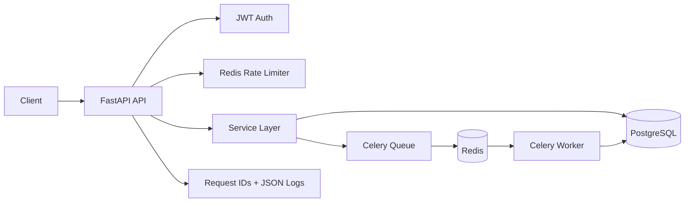

# TaskForge API

[](https://github.com/MridulJain0771/taskforge-api/actions/workflows/ci.yml)


**Production-style FastAPI backend demonstrating the engineering patterns expected in Backend Engineer / SDE II systems: authentication, PostgreSQL, Redis, background processing, idempotency, rate limiting, migrations, observability, Docker and automated CI.**

TaskForge is intentionally more than a CRUD portfolio API. It focuses on the operational concerns that appear when services are retried, deployed, scaled, tested and maintained by a team.

## Highlights

- Versioned FastAPI REST API with OpenAPI/Swagger documentation
- PostgreSQL + SQLAlchemy 2.0 async persistence layer
- Alembic migrations validated against a fresh PostgreSQL database in CI
- JWT bearer authentication and scrypt password hashing with random salts
- Redis-backed fixed-window rate limiting
- Celery background jobs with Redis broker/result backend and retries
- Idempotent task creation via `Idempotency-Key`
- Structured JSON logging and per-request `X-Request-ID`
- Liveness and dependency-aware readiness probes
- FastAPI lifespan management for clean PostgreSQL and Redis shutdown
- Docker image running as a non-root application user
- Docker Compose stack for API, PostgreSQL, Redis and Celery worker
- Unit tests, integration tests, API smoke tests and Docker runtime checks
- GitHub Actions CI on pushes, pull requests and manual runs

## Architecture



The API stays focused on request validation and orchestration, while persistence logic lives in services, asynchronous work is delegated to Celery, PostgreSQL stores durable state, and Redis supports both rate limiting and background-job infrastructure.

## API Surface

| Method | Endpoint | Purpose |
|---|---|---|
| `POST` | `/api/v1/auth/register` | Create a user |
| `POST` | `/api/v1/auth/login` | Authenticate and issue a JWT |
| `GET` | `/api/v1/users/me` | Return the authenticated user |
| `POST` | `/api/v1/tasks` | Create a task; supports `Idempotency-Key` |
| `GET` | `/api/v1/tasks` | Return a paginated task list |
| `GET` | `/api/v1/tasks/{id}` | Fetch one task |
| `PATCH` | `/api/v1/tasks/{id}` | Update a task |
| `DELETE` | `/api/v1/tasks/{id}` | Delete a task |
| `POST` | `/api/v1/tasks/{id}/process` | Queue background processing |
| `GET` | `/health/live` | Liveness probe |
| `GET` | `/health/ready` | PostgreSQL + Redis readiness probe |

## Quick Start

### Docker Compose

```bash
cp .env.example .env
docker compose up --build
```

Once the stack is healthy:

- API: `http://localhost:8000`
- Swagger UI: `http://localhost:8000/docs`
- OpenAPI schema: `http://localhost:8000/openapi.json`

### Run the API directly

```bash
python -m venv .venv
source .venv/bin/activate
pip install -r requirements-dev.txt
cp .env.example .env
alembic upgrade head
uvicorn app.main:app --reload
```

On Windows PowerShell, activate the environment with:

```powershell
.venv\Scripts\Activate.ps1
```

PostgreSQL and Redis still need to be available when running the API directly.

## Example Flow

### 1. Register

```bash
curl -X POST http://localhost:8000/api/v1/auth/register \
  -H "Content-Type: application/json" \
  -d '{"email":"dev@example.com","password":"strong-password"}'
```

### 2. Login

```bash
curl -X POST http://localhost:8000/api/v1/auth/login \
  -H "Content-Type: application/x-www-form-urlencoded" \
  -d "username=dev@example.com&password=strong-password"
```

Use the returned `access_token` as a bearer token for authenticated endpoints.

### 3. Create an idempotent task

```bash
curl -X POST http://localhost:8000/api/v1/tasks \
  -H "Authorization: Bearer <access_token>" \
  -H "Content-Type: application/json" \
  -H "Idempotency-Key: create-task-001" \
  -d '{"title":"Generate monthly report","description":"Process source records"}'
```

If a client safely retries the same create request with the same idempotency key, the API can return the already-created resource rather than intentionally creating a duplicate.

## Engineering Decisions

| Concern | Implementation | Why it matters |
|---|---|---|
| Authentication | JWT bearer tokens | Keeps authenticated API calls stateless |
| Password storage | `scrypt` + random salt | Avoids storing plaintext passwords and uses a memory-hard KDF |
| Persistence | PostgreSQL + async SQLAlchemy | Durable relational storage with non-blocking DB access |
| Schema changes | Alembic | Makes database evolution explicit and repeatable |
| Rate limiting | Redis fixed-window counters | Shares limits across API instances rather than process-local memory |
| Retry safety | `Idempotency-Key` | Reduces duplicate writes when clients retry requests |
| Background work | Celery + Redis | Moves longer-running processing outside request latency |
| Observability | Request IDs + JSON logs | Makes requests easier to correlate across logs |
| Health checks | `/live` and `/ready` | Separates process health from dependency readiness |
| Resource lifecycle | FastAPI lifespan | Disposes async PostgreSQL/Redis resources on the correct event loop |
| Container security | Non-root `app` user | Reduces container privileges by default |

## CI Pipeline

The GitHub Actions workflow validates the repository on every push to `master`/`main`, on pull requests, and through a manual **Run workflow** action.

### Backend validation job

```text
Checkout
  ↓
Install dependencies + pip check
  ↓
Compile Python source
  ↓
Ruff
  ↓
Start PostgreSQL + Redis
  ↓
Alembic migration
  ↓
Unit tests
  ↓
Integration tests
  ↓
Start FastAPI
  ↓
/health/live + /health/ready smoke tests
```

### Docker validation job

```text
Build Docker image
  ↓
Verify non-root user
  ↓
Start container
  ↓
Call /health/live
```

This means a green CI result checks more than test assertions: the project must install cleanly, migrate a fresh database, pass code checks, pass unit/integration tests, start as a real API process, build as a Docker image and successfully run inside that image.

## Run Tests Locally

```bash
pip install -r requirements-dev.txt
pip check
python -m compileall -q app
ruff check .
alembic upgrade head
pytest -q tests/unit
pytest -q tests/integration
```

Integration tests require PostgreSQL and Redis. GitHub Actions provisions both automatically.

## Project Structure

```text
app/
  api/          # Routes and API dependencies
  core/         # Configuration, security, middleware and logging
  db/           # SQLAlchemy engine, session and declarative base
  models/       # Persistence models
  schemas/      # Pydantic request/response contracts
  services/     # Business and persistence operations
  workers/      # Celery application and background jobs
migrations/     # Alembic schema history
tests/
  unit/         # Focused security/unit tests
  integration/  # API + PostgreSQL + Redis flows
docs/           # Architecture documentation
.github/
  workflows/    # GitHub Actions CI
```

## Design Notes and Scaling Paths

See [`docs/ARCHITECTURE.md`](docs/ARCHITECTURE.md) for deeper architecture notes, trade-offs and scaling considerations.

Natural next steps for a larger production system would include refresh-token rotation/revocation, stronger concurrent idempotency semantics, metrics/tracing, queue dead-letter handling and deployment infrastructure.
