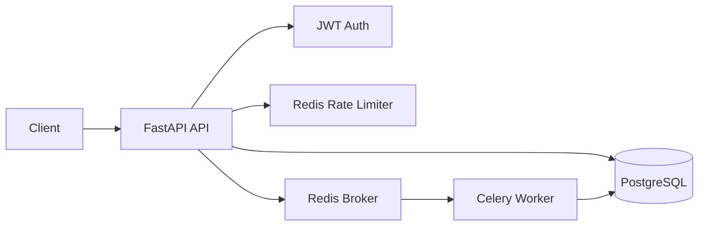

# Architecture

TaskForge is intentionally structured like a production backend rather than a tutorial CRUD app.

## Request path

1. Request ID middleware attaches a traceable request ID.
2. Redis middleware applies rate limiting.
3. JWT authentication resolves the active user from PostgreSQL.
4. Route handlers delegate persistence to service functions.
5. Idempotency keys make task creation safe to retry.
6. Long-running work is queued to Celery.

## Reliability decisions

- PostgreSQL is the source of truth.
- Redis stores rate-limit counters and Celery broker/results.
- Alembic provides reproducible schema changes.
- Celery retries use bounded exponential backoff.
- Readiness and liveness endpoints are separate.
- Docker Compose reproduces the service topology locally.
- GitHub Actions runs linting, migrations, and tests.

## Scaling path

Scale API replicas horizontally behind a load balancer, move PostgreSQL and Redis to managed services, split Celery queues by workload, and add metrics/tracing for production observability.
